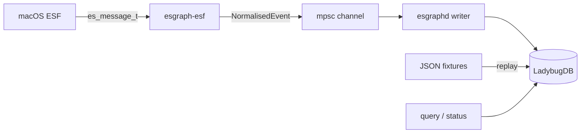

# Architecture

esgraph ingests macOS Endpoint Security Framework (ESF) events into an embedded LadybugDB graph of processes, files, and sockets.

## System overview

## Crates

| Crate | Role | Platform |
|-------|------|----------|
| [esgraph-core](core.md) | Config, event names, graph model | Any |
| [esgraph-store](store.md) | LadybugDB schema and ingest | Any |
| [esgraph-esf](esf.md) | Live ESF client | macOS only |
| [esgraphd](cli.md) | CLI: replay, query, status, run | Any (run = macOS) |

## Data model

ESF messages normalise to `NormalisedEvent`:

- **Nodes** — process (keyed by audit token), file (path), socket (UIPC path)
- **Edges** — directed, timestamped relationships (`WROTE`, `EXECUTED`, …)

Details: [core — graph model](core.md#graph-model).

## Live pipeline threading

`endpoint_sec::Client` is not `Send`. In `esgraphd run`:

1. **Main thread** — owns ES client, normalises messages, sends to channel
2. **Writer thread** — owns `GraphStore`, batches ingest, flushes on size or interval

Shutdown via `AtomicBool` (Ctrl+C). Writer drains the channel before exit.

Details: [CLI — run](cli.md#run-live-esf), [ESF collector](esf.md).

## Storage

Labelled nodes (`Process`, `File`, `Socket`, `IngestEvent`) and typed relationships (`WROTE`, `EXECUTED`, …). Hunt queries use Cypher, including multi-hop patterns.

Details: [store](store.md).

## Configuration

TOML drives subscriptions, graph directory path, batching, and ESF path muting.

Details: [config](config.md).

## Deployment

Host builds; VM runs live ESF with signed binary and FDA.

Details: [deployment](deployment.md), [VM setup](vm-setup.md).

## Documentation index

| Document | Contents |
|----------|----------|
| [core.md](core.md) | Config, events, graph types |
| [store.md](store.md) | LadybugDB schema and ingest |
| [esf.md](esf.md) | ESF subscribe, normalise, collector |
| [cli.md](cli.md) | esgraphd commands |
| [config.md](config.md) | TOML files and validation |
| [vm-setup.md](vm-setup.md) | Entitlement, root, FDA |
| [deployment.md](deployment.md) | deploy-vm.sh, debug-vm.sh |
