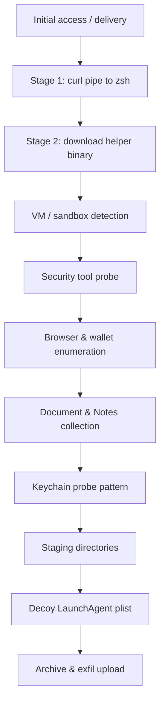

# AMOS attack chain scenario

Non-destructive behavioural emulation of [AMOS](https://attack.mitre.org/software/S1048/) (Atomic macOS Stealer), based on the analysis in [Objective-See blog 0x88](https://objective-see.org/blog/blog_0x88.html). The scenario exercises a multi-stage macOS stealer.

**Do not run against production systems.** Intended for isolated VMs only.

## Run

```bash
./scripts/simulate-vm.sh --scenario amos/amos_stealer_chain
```

## Attack chain overview

Real AMOS is distributed via malicious ads, fake software updates, and social engineering. Victims are steered into running shell one-liners that download and execute the stealer. Once running, AMOS checks for analysis environments, probes for security tools, harvests browser credentials and crypto wallets, grabs local documents and notes, stages data under hidden directories, and exfiltrates an archive to attacker infrastructure. It may also prompt for passwords via AppleScript and attempt persistence via LaunchAgents.

This scenario reproduces that *sequence of behaviours* using benign commands and staging paths under `/tmp`. It does not install malware, load LaunchAgents, kill security tools, or exfiltrate real secrets.




## Stages (mapped to MITRE ATT&CK)


| Phase                     | What the scenario does                                                                                                                                                                                                      | MITRE                                                                                                                                                                   |
| ------------------------- | --------------------------------------------------------------------------------------------------------------------------------------------------------------------------------------------------------------------------- | ----------------------------------------------------------------------------------------------------------------------------------------------------------------------- |
| **Delivery**              | Base64-encodes the stage-1 URL, then `curl … | zsh -s` fetches `/curl/stage1` from the host HTTP server. Also downloads `/frozenfix/update` directly as a fallback path.                                                    | [T1204.002](https://attack.mitre.org/techniques/T1204/002/) User Execution: Malicious File                                                                              |
| **Stage 1 payload**       | Host serves `stage1.sh`, which curls `helper.sh`, marks execution, and runs it. Benign helper writes a marker file only.                                                                                                    | [T1059.004](https://attack.mitre.org/techniques/T1059/004/) Unix Shell, [T1105](https://attack.mitre.org/techniques/T1105/) Ingress Tool Transfer                       |
| **VM detection**          | Runs `system_profiler SPMemoryDataType` and `SPHardwareDataType`, greps for QEMU/VMware/KVM and other VM indicators. AMOS aborts on real hardware when it detects a VM; here the check is recorded but execution continues. | [T1497.001](https://attack.mitre.org/techniques/T1497/001/) Virtualization/Sandbox Evasion: System Checks                                                               |
| **User prompt**           | If stdin is a TTY, shows a simulated “System Helper Installation” `osascript` dialog (auto-dismissed after 10s). Skipped over non-interactive SSH.                                                                          | [T1059.002](https://attack.mitre.org/techniques/T1059/002/) AppleScript                                                                                                 |
| **Security tool probe**   | `pgrep`, `launchctl list`, and `killall -0` against Little Snitch, BlockBlock, and LuLu. Output is logged; no processes are killed.                                                                                         | [T1518.001](https://attack.mitre.org/techniques/T1518/001/) Security Software Discovery                                                                                 |
| **Browser enumeration**   | Lists Chrome, Brave, Edge, Opera, and Firefox profile directories; searches for `Login Data`, `Cookies`, and `Web Data` files.                                                                                              | [T1555.003](https://attack.mitre.org/techniques/T1555/003/) Credentials from Web Browsers, [T1539](https://attack.mitre.org/techniques/T1539/) Steal Web Session Cookie |
| **Crypto wallet search**  | Looks for known wallet extension IDs (MetaMask, Phantom, etc.) under Chrome `Local Extension Settings`.                                                                                                                     | [T1555.003](https://attack.mitre.org/techniques/T1555/003/)                                                                                                             |
| **Local data collection** | Copies `NoteStore.sqlite` if present; finds and copies small text/PDF/Office/Keynote files from Desktop and Documents (≤ 1 MiB).                                                                                            | [T1005](https://attack.mitre.org/techniques/T1005/) Data from Local System                                                                                              |
| **Keychain pattern**      | `security list-keychains` and records the `security find-generic-password` command pattern AMOS uses. No passwords are read or exported.                                                                                    | [T1555.001](https://attack.mitre.org/techniques/T1555/001/) Credentials from Password Stores                                                                            |
| **Staging**               | Creates `staging-config/` and `staging-local/` under the scenario temp root (not real `~/.config` / `~/.local`).                                                                                                            | [T1074.001](https://attack.mitre.org/techniques/T1074/001/) Local Data Staging                                                                                          |
| **Persistence decoy**     | Writes `com.apple.mdworker.plist` to the staging `decoy/` directory only. The plist is **not** installed or loaded.                                                                                                         | [T1543.001](https://attack.mitre.org/techniques/T1543/001/) Launch Agent                                                                                                |
| **Archive & exfil**       | `tar -czf` archives `exfil/`, `enum/`, `decoy/`, and staging dirs, then POSTs the archive to `${ESGRAPH_HOST_HTTP}/upload`.                                                                                                 | [T1560.001](https://attack.mitre.org/techniques/T1560/001/) Archive via Utility, [T1041](https://attack.mitre.org/techniques/T1041/) Exfiltration Over C2 Channel       |


## Host HTTP server endpoints

When the scenario runs, the host C2 emulator exposes:


| Endpoint                | Role                                                       |
| ----------------------- | ---------------------------------------------------------- |
| `GET /curl/stage1`      | Serves `stage1.sh` (ClickFix-style pipe-to-shell delivery) |
| `GET /frozenfix/update` | Serves `helper.sh` (second-stage helper)                   |
| `POST /upload`          | Receives the staged archive from the VM                    |
| `GET /health`           | Health check used during server startup                    |


Captured uploads land in `<run-dir>/host-http/uploads/` on the host.

## VM artefacts

All paths are scoped by `ESGRAPH_RUN_ID` so cleanup can target them precisely.


| Path                                         | Contents                                                                                        |
| -------------------------------------------- | ----------------------------------------------------------------------------------------------- |
| `/tmp/amos_chain_${ESGRAPH_RUN_ID}/`         | Scenario root: `exfil/`, `enum/`, `decoy/`, staging dirs                                        |
| `/tmp/amos_chain_${ESGRAPH_RUN_ID}/enum/`    | VM indicators, browser paths, security-tool probe output, document candidates, keychain listing |
| `/tmp/amos_chain_${ESGRAPH_RUN_ID}/exfil/`   | Benign copies of Notes DB and small documents (or placeholders)                                 |
| `/tmp/amos_chain_${ESGRAPH_RUN_ID}/decoy/`   | LaunchAgent plist (not loaded)                                                                  |
| `/tmp/amos_helper_${ESGRAPH_RUN_ID}`         | Downloaded helper script                                                                        |
| `/tmp/amos_helper_ran_${ESGRAPH_RUN_ID}`     | Marker written when helper executes                                                             |
| `/tmp/amos_archive_${ESGRAPH_RUN_ID}.tar.gz` | Archive uploaded to host                                                                        |


## Cleanup

After the LadybugDB database is copied to the host, `[amos_stealer_chain.cleanup.sh](amos_stealer_chain.cleanup.sh)` removes all paths above. Cleanup also runs if the scenario fails or the simulation is interrupted.

## Scripts


| File                                                               | Purpose                                         |
| ------------------------------------------------------------------ | ----------------------------------------------- |
| `[amos_stealer_chain.scenario.sh](amos_stealer_chain.scenario.sh)` | Execution — runs while `esgraphd` is collecting |
| `[amos_stealer_chain.cleanup.sh](amos_stealer_chain.cleanup.sh)`   | Cleanup — removes VM artefacts after collection |


## References

- [AMOS — MITRE S1048](https://attack.mitre.org/software/S1048/)
- [AMOS Stealer — Objective-See blog 0x88](https://objective-see.org/blog/blog_0x88.html)
- [Attack scenarios overview](../README.md)

